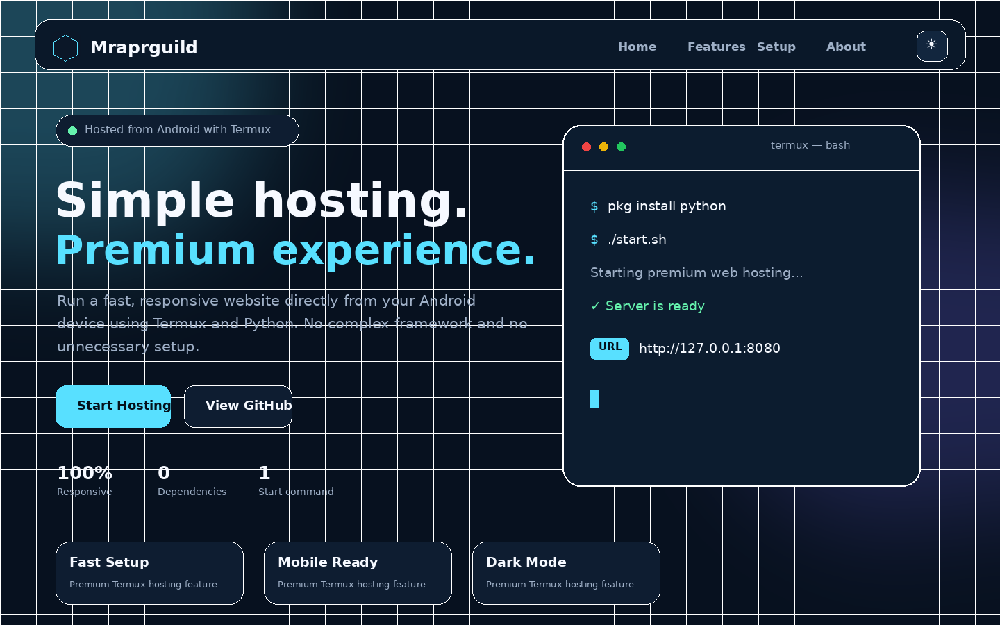

<div align="center">

# 🍥 TERMUX PREMIUM WEB HOSTING 🍥

### ⚡ Ninja-Themed Android Web Server ⚡


<br>


<br>

> **Transform your Android device into a lightweight web-hosting server using Termux and Python.**

[Features](#-ninja-abilities) •
[Installation](#-summoning-installation) •
[Commands](#-ninja-commands) •
[Customization](#-customize-your-village) •
[GitHub Pages](#-deploy-to-github-pages)

</div>

---

## 🖼️ Website Screenshot

<div align="center">



</div>

---

## 🔥 Ninja Mission

**Termux Premium Web Hosting** is a fast and beginner-friendly project that lets you host a static website directly from an Android phone.

It includes a premium responsive landing page, dark mode, smooth animations, background server controls, and GitHub-ready project files.

```text
╔══════════════════════════════════════════════╗
║     MRAPRGUILD TERMUX HOSTING SYSTEM         ║
║                                              ║
║  Status : Ready                              ║
║  Server : Python HTTP Server                 ║
║  Device : Android + Termux                   ║
║  Mode   : Local Static Web Hosting           ║
╚══════════════════════════════════════════════╝
```

---

## ⚔️ Ninja Abilities

| Ability | Description |
|---|---|
| ⚡ Fast Setup | Install and launch with simple Termux commands |
| 📱 Mobile Ready | Responsive layout for phones, tablets, and desktops |
| 🌙 Theme Mode | Built-in dark and light color modes |
| 🌀 Smooth Motion | Scroll reveal effects and animated interface elements |
| 🖥️ Server Control | Start, stop, and check background server status |
| 🧩 Easy Editing | Plain HTML, CSS, JavaScript, and shell scripts |
| 🛡️ Lightweight | No advanced framework or database required |
| 🐙 GitHub Ready | README, license, `.gitignore`, and clean structure |

---

## 📂 Hidden Scroll: Project Structure

```text
termux-premium-web-hosting/
│
├── public/
│   ├── assets/
│   │   └── logo.svg
│   ├── index.html
│   ├── 404.html
│   ├── style.css
│   └── script.js
│
├── install.sh
├── start.sh
├── stop.sh
├── status.sh
├── README.md
├── LICENSE
└── .gitignore
```

---

## 🍥 Summoning Installation

### 1. Update Termux

```bash
pkg update -y
pkg upgrade -y
```

### 2. Install Git

```bash
pkg install git -y
```

### 3. Clone the project

```bash
git clone https://github.com/Mraprguild/termux-premium-web-hosting.git
```

### 4. Open the project

```bash
cd termux-premium-web-hosting
```

### 5. Give script permission

```bash
chmod +x *.sh
```

### 6. Install requirements

```bash
./install.sh
```

### 7. Start the server

```bash
./start.sh
```

Open this address in your browser:

```text
http://127.0.0.1:8080
```

---

## 🌀 Ninja Commands

### Start in foreground

```bash
./start.sh
```

Press `CTRL + C` to stop the server.

### Start in background

```bash
./start.sh --background
```

### Check server status

```bash
./status.sh
```

### Stop background server

```bash
./stop.sh
```

### Use a different port

```bash
PORT=3000 ./start.sh
```

Then open:

```text
http://127.0.0.1:3000
```

---

## 🏯 Customize Your Village

Your website files are stored inside:

```text
public/
```

### Edit the homepage

```bash
nano public/index.html
```

### Edit website styles

```bash
nano public/style.css
```

### Edit JavaScript

```bash
nano public/script.js
```

### Replace the logo

Replace:

```text
public/assets/logo.svg
```

Save files in Nano with:

```text
CTRL + X
Y
ENTER
```

Restart the server after editing.

---

## 🌐 Deploy to GitHub Pages

Upload the project to GitHub:

```bash
git init
git add .
git commit -m "Add Termux premium web hosting project"
git branch -M main
git remote add origin https://github.com/Mraprguild/termux-premium-web-hosting.git
git push -u origin main
```

Open your GitHub repository and select:

```text
Settings → Pages
```

Configure:

```text
Source : Deploy from a branch
Branch : main
Folder : /public
```

Your website address will look like:

```text
https://mraprguild.github.io/termux-premium-web-hosting/
```

---

## 🛠️ Troubleshooting

### Python command not found

```bash
pkg install python -y
```

### Permission denied

```bash
chmod +x install.sh start.sh stop.sh status.sh
```

### Port already in use

```bash
PORT=8081 ./start.sh
```

### Stop an existing background server

```bash
./stop.sh
```

### Check the server log

```bash
cat server.log
```

---

## 📜 Ninja Rules

Use this project for:

- Learning web development
- Hosting your own static website
- Local website testing
- GitHub Pages deployment
- Authorized development projects

The built-in Python server is designed for lightweight development and local hosting. Keep Termux running while using the local server.

---

## 🤝 Join the Guild

Contributions are welcome.

```bash
git checkout -b feature/my-update
git add .
git commit -m "Add new feature"
git push origin feature/my-update
```

Then open a pull request on GitHub.

---

## 👑 Creator

<div align="center">

### **MRAPRGUILD**

GitHub profile:

**https://github.com/Mraprguild**

<br>

```text
"The strongest project begins with one command."
```

<br>


</div>

---

## 📄 License

This project is released under the **MIT License**.

```text
Copyright © 2026 Mraprguild
```

<div align="center">

## 🍥 End of the Scroll 🍥

**Star ⭐ the repository if this project helped you.**

</div>
